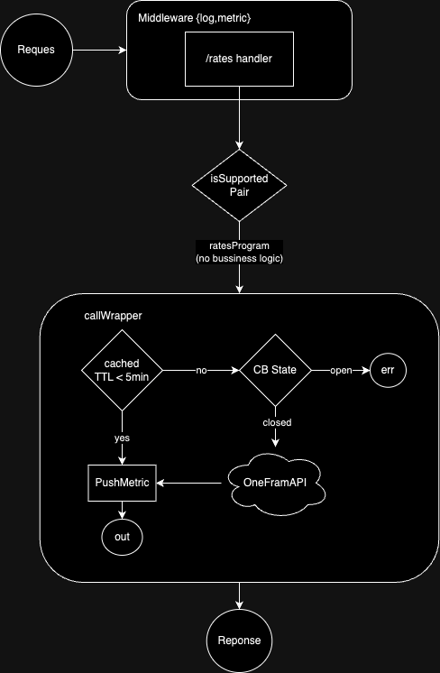

# Forex-mtl

This project is a live interpreter for a one-frame service that provides exchange rate information. The application operates under the following logic:

1. The service returns the exchange rate when two supported currencies are provided.
2. The exchange rate must not be older than 5 minutes.
3. The service is designed to handle at least 10,000 successful requests per day with a single API token.

Please note that the one-frame API has a limitation of 1,000 calls per day.

## Disclaimer
This project heavily leverages generative AI platforms such as OpenAI and Claude. As someone who was unfamiliar with the Scala programming language, these tools were invaluable in helping me understand and implement Scala concepts effectively. Their assistance made it possible for me to deliver a well-architected solution despite my initial lack of experience with Scala.

## Prerequisite
- Docker
- Java ~ openjdk 17.0.12 (2024-07-16)
- scalaVersion "2.13.12"
- sbt.version "1.9.2"

## How to Run This Project Locally
Before running the project, ensure you copy the `.env.example` file to `.env` and populate it with the correct values. For the `ONE_FRAME_TOKEN`, you can use: `10dc303535874aeccc86a8251e6992f5` as mentioned on the [Docker Hub for paidyinc/one-frame](https://hub.docker.com/r/paidyinc/one-frame).

You can choose from the following options to run the project:

1. **Using Docker**:
   - Start everything at once by running:
     ```bash
     docker-compose --profile app up -d --build
     ```

2. **Compile and run the project locally**:
   - Spawn the necessary dependencies locally:
     ```bash
     docker-compose up -d
     ```
   - Compile the project:
     ```bash
     make all
     ```
   - Run the app:
     ```bash
     make run
     ```

3. **Run tests only**:
   - Execute tests via the SBT console, or simply run:
     ```bash
     make test
     ```

## System Diagram


### Workflow Description
The following diagram outlines the logic behind the `/rates` API endpoint. The workflow demonstrates how requests are handled and how caching, circuit breaking, and metrics recording work together to ensure efficiency and reliability.

**Workflow Steps:**

1. **Middleware (Logging & Metrics)**:  
   All requests to the `/rates` endpoint pass through middleware that handles logging and metrics collection, ensuring all request data is captured for monitoring and diagnostics.

2. **Rates Handler**:  
   The `/rates` handler processes the request and checks if the currency pair is supported.

3. **Supported Pair Check**:  
   If the currency pair is not supported, the handler immediately returns an error.

4. **Call Wrapper**:  
   If the pair is supported, the request moves to the `callWrapper` class, which manages the logic of caching and circuit breaking:
   - **Cached TTL Check**: The `callWrapper` verifies if there is a cached response for the currency pair and whether the TTL (time-to-live) is less than 5 minutes.
   - **Circuit Breaker State**:
      - **Closed State**: If no cached data exists or it is expired, a new request is sent to `OneFrameAPI` to fetch the latest data.
      - **Open State**: If the circuit breaker is open (due to previous errors), the request fails with an error response.

5. **Push Metric**:  
   If cached data is used, the system logs the relevant metrics using the `PushMetric` method, ensuring performance data is recorded for monitoring.

6. **Response**:  
   The response, either from cached data or the external API, is returned to the client. If the pair is unsupported or an error occurs, an appropriate error message is returned.

### Conclusion:
This workflow leverages caching and circuit breaking to handle requests efficiently while ensuring that metrics are collected for observability and troubleshooting. The architecture helps reduce latency and maintain system resilience, even during temporary service disruptions.

## Technical Overview
This project adopts several technical approaches to meet the standard of a modern, scalable microservice.

### Frameworks and Libraries:
- **HTTP Framework**: http4s
- **Configuration Management**: PureConfig
- **Circuit Breaker and Resilience**: The project uses Resilience4j to apply circuit breaker patterns, which ensure resilient service communication and proper handling of failures.
- **Asynchronous and Non-blocking IO**: Scala's functional programming ecosystem (Cats Effect, ZIO, or Monix) is used to handle concurrency, non-blocking I/O, and error handling effectively.

### Resilience and Fault Tolerance:
- Circuit Breaker implementation prevents cascading failures across services.
- ~~SingleFlight Mechanism (postponed)~~: Initially, the SingleFlight mechanism was considered to optimize redundant requests. However, due to dependency conflicts, this feature was not implemented and may be revisited later.

### Testing:
- **Unit Testing**: ScalaTest or MUnit is employed to test individual units of the codebase.

### Observability (Logging, Monitoring, and Tracing):
- **Logging**: The project uses structured logging (Logback) in JSON format to ensure that logs are machine-readable and easy to parse.
- **Metrics & Monitoring**: Metrics are collected via Prometheus and visualized in Grafana dashboards.
- ~~**Distributed Tracing** (To be Planned)~~: Tracing libraries like OpenTelemetry will be integrated to monitor and trace requests across the system.

### Caching:
- **Caching**: Memcached is used to cache frequently accessed data, reducing load on the API and improving response times.

### Security:
- **Data Validation**: Input data is validated to ensure robustness.
- **HTTPS**: For production environments, HTTPS is used for secure communication between services.

### Continuous Integration and Continuous Deployment (CI/CD):
- CI/CD pipelines are set up using GitHub Actions to automate testing, building, and deployment within the microservice architecture.
